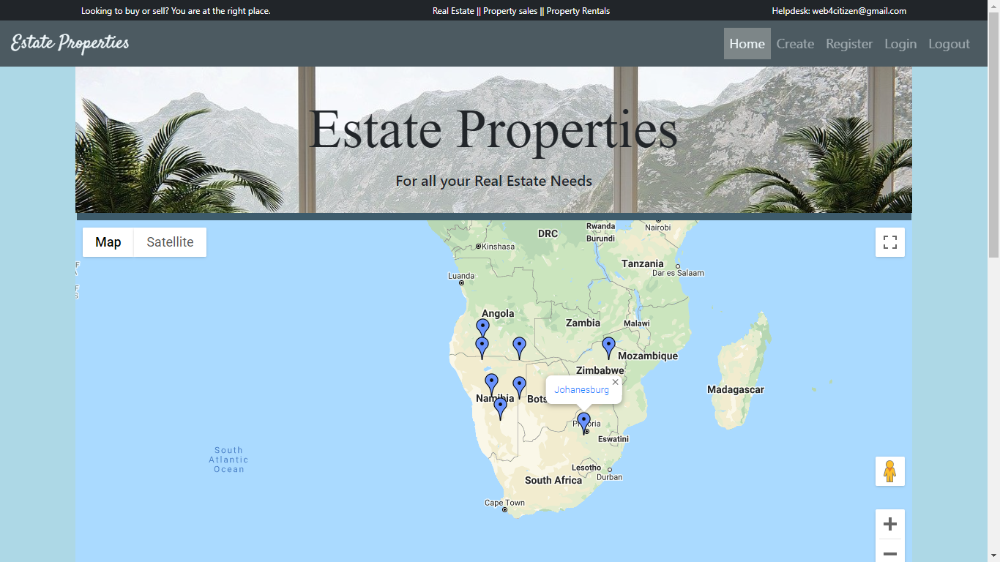

# Estate-Properties-App
*Repository holds real-estate website code, built with php and google-maps api. Other interesting map-based api's are contained in the repository.

*The application allows users to sign-up and showcase properties for rent or sale. Application developed with PHP, HTML, CSS, Bootstrap, JavaScript & Regex.

Demo: [Video Demo](https://www.youtube.com/watch?v=lhe-pnms0nk).

